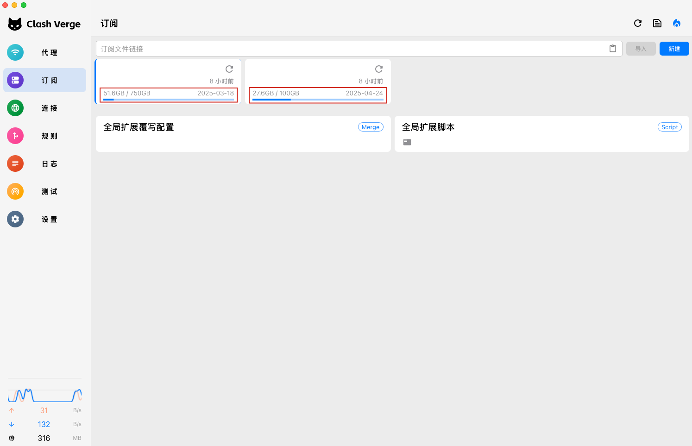
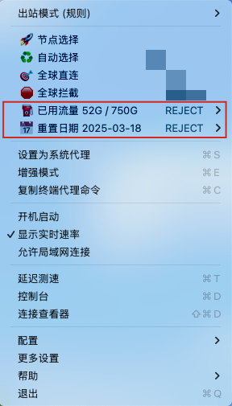

# VPSub

[](https://goreportcard.com/report/github.com/djx30103/vpsub)
[](https://github.com/djx30103/vpsub/releases)
[](https://github.com/djx30103/vpsub)
[](https://github.com/djx30103/vpsub/stargazers)
[](https://github.com/djx30103/vpsub/blob/main/LICENSE)

一个轻量级的VPS流量监控工具，帮助自建节点用户实时掌握各节点的流量使用情况。通过获取VPS服务商的流量数据并注入到订阅文件中，让你在使用代理客户端时直观地了解每个节点的流量状态。

## ✨ 核心特性

### 🔄 流量管理
- **实时监控**: 获取VPS流量使用数据，包括已用流量、剩余流量、总流量和重置时间
- **订阅集成**: 自动将流量信息注入到订阅文件，支持在代理软件中直观显示

### 🛠 系统特性
- **多账户管理**: 支持多个VPS账号和订阅文件的统一管理
- **高效缓存**: 多级缓存机制，智能避免API限速
- **容器部署**: 支持Docker容器化部署，便于维护和迁移
- **多服务商**: 支持多种VPS服务商API，持续扩展中

## 📊 支持的服务商

| <div align="center">服务商</div> | <div align="center">流量查询</div> | <div align="center">重置日期</div> | <div align="center">配置参数映射</div> |
|:-------:|:---------:|:---------:|:-------------:|
| BandwagonHost | ✅ | ✅ | `api_id`: VEID<br>`api_key`: API KEY |
| RackNerd | ✅ | ❌ | `api_id`: API Hash<br>`api_key`: API Key |
| 更多服务商 | 🔄 | 🔄 | 敬请期待 |

</div>

## 🔍 工作原理

VPSub 通过以下步骤处理每个订阅请求：
```
1. 读取配置文件中的VPS服务商API凭证
2. 调用相应服务商的API获取流量使用情况
3. 读取订阅文件内容
4. 将流量信息注入到HTTP响应头中或添加到组中
5. 返回订阅文件内容，同时包含流量信息
```

## 使用效果

### Clash Verge Rev


### ClashX (添加流量组后的效果)



## 🚀 快速开始

### 1. 安装部署

#### 方式一：直接运行

```bash
# 克隆仓库
git clone https://github.com/djx30103/vpsub.git
cd vpsub

# 直接运行
go run cmd/server/main.go

# 或者构建后运行
go build -o vpsub cmd/server/main.go
./vpsub
```

#### 方式二：Docker部署

```bash
docker run -d \
  --name vpsub \
  -p 30103:30103 \
  -v $(pwd)/config:/app/config \
  -v $(pwd)/subscriptions:/app/subscriptions \
  ghcr.io/djx30103/vpsub:latest
```

#### 方式三：使用Docker Compose

```yaml
services:
  vpsub:
    image: ghcr.io/djx30103/vpsub:latest
    container_name: vpsub
    ports:
      - "30103:30103"
    volumes:
      - ./data/config:/app/config
      - ./data/subscriptions:/app/subscriptions
    restart: unless-stopped
    environment:
      TZ: Asia/Shanghai
```

运行：

```bash
docker-compose up -d
```

### 2. 准备订阅文件

将你的代理配置文件放入`subscriptions`目录。

### 3. 修改配置文件

编辑`config/config.yml`文件，添加你的API凭证和订阅文件信息：

#### 最小配置示例

以下是最小配置示例，其他配置项将使用系统默认值：

```yaml
# VPS服务商配置列表
providers:
  # BandwagonHost 服务配置
  bandwagonhost:
    # API路由前缀
    - route_prefix: "/2e9d2eee7d2e40d399998c85853f68f4"
      # API凭证
      api_id: "VEID"
      api_key: "API KEY"
      # 关联的订阅配置文件列表
      subscriptions:
        - "1.yaml"
      # 是否需要启用分组展示
#      overrides:
#        usage_display:
#          enable: true
```

#### 完整配置示例

如果你需要更细致的控制，可以参考以下完整配置：

```yaml

# 应用模式：release、debug（默认release）
app_mode: release

# 服务器配置
server:
  # HTTP服务监听地址和端口号 (格式: [IP]:PORT, 示例: :30103, 127.0.0.1:30103)
  listen_addr: :30103
  # 请求超时时间
  timeout: 30s

# 日志配置
log:
  # 日志级别: debug, info, warn, error
  level: warn

# 全局配置项
global:
  # 文件存储相关配置
  storage:
    # 订阅文件存储主目录
    subscription_dir: ./subscriptions

# 默认配置参数 (各服务商可在 overrides 中覆盖这些设置)
defaults:
  # 缓存策略配置
  # 缓存分为三个层次：
  # 1. file_ttl: 订阅文件的原始内容缓存
  # 2. api_ttl: 服务商 API 返回数据的缓存
  # 3. response_ttl: 最终生成的订阅内容缓存（合并了文件内容和 API 数据）
  # 所有缓存均按请求路径（path）进行存储，相同路径的请求会复用缓存内容
  cache:
    # 订阅文件缓存时间，0表示不缓存
    # 按请求路径缓存，文件内容缓存后，修改文件需等待缓存失效才能生效
    file_ttl: 0

    # API响应缓存时间，0表示不缓存
    # 按请求路径缓存，建议开启以避免触发服务商限速
    # 如果配置了 response_ttl，可以不配置此项
    api_ttl: 0

    # 最终响应缓存时间，0表示不缓存
    # 按请求路径缓存最终的订阅内容（文件内容 + API响应结果的组合）
    response_ttl: 60s

  # 服务商通用参数配置
  provider:
    # API请求超时时间限制
    request_timeout: 10s
    # 数据更新间隔
    update_interval: 24h

  # 用户流量统计与到期时间显示配置
  usage_display:
    # 是否在代理分组中显示用户流量和到期信息
    enable: false
    # 信息分组在列表中的位置 (true: 置顶显示, false: 末尾显示)
    prepend: false
    # 流量使用情况的显示模板 (支持变量: {{.used}} - 已用流量, {{.total}} - 总流量)
    traffic_format: "⛽ 已用流量 {{.used}} / {{.total}}"
    # 流量显示单位 (可选: B, K, M, G, T)
    traffic_unit: "G"
    # 重置日期的显示模板 (支持变量: {{.year}}-年, {{.month}}-月, {{.day}}-日, {{.hour}}-时, {{.minute}}-分, {{.second}}-秒)
    expire_format: "📅 重置日期 {{.year}}-{{.month}}-{{.day}}"

# VPS服务商配置列表
providers:
  # BandwagonHost 服务配置
  bandwagonhost:
    # API路由前缀
    - route_prefix: "/route_prefix1"
      # API凭证
      api_id: "VEID"
      api_key: "API KEY"
      # 关联的订阅配置文件列表
      subscriptions:
        - "b1.yaml"
        - "b2.yaml"

    - route_prefix: "/route_prefix2"
      # API凭证
      api_id: "VEID"
      api_key: "API KEY"
      # 关联的订阅配置文件列表
      subscriptions:
        - "b3.yaml"
        - "b4.yaml"
      # 实例特定的配置覆盖
      overrides:
        cache:
          file_ttl: 30s
          api_ttl: 60s
          response_ttl: 0
        provider:
          request_timeout: 10s
          update_interval: 24h
        usage_display:
          enable: true
          prepend: true
          traffic_format: "⛽ 已用流量 {{.used}} / {{.total}}"
          traffic_unit: "M"
          expire_format: "📅 重置日期 {{.year}}/{{.month}}/{{.day}}"

  # RackNerd 服务配置
  racknerd:
    - route_prefix: "/route_prefix3"
      api_id: "API Hash"
      api_key: "API Key"
      # 关联的订阅配置文件列表
      subscriptions:
        - "rn.yaml"


```

### 4. 使用订阅链接

#### 订阅链接格式

```
http://your-server:30103/<route_prefix>/<subscription_file>
```

#### 参数说明

- `your-server`: 你的服务器地址
- `route_prefix`: 配置文件中设置的路由前缀
- `subscription_file`: 订阅文件名称（例如：bwg.yaml）

#### 示例

如果你的配置如下：
```yaml
providers:
  bandwagonhost:
    - route_prefix: "/bwh01"
      subscriptions:
        - "my-proxy.yaml"
```

那么你的订阅链接就是：
```
http://your-server:30103/bwh01/my-proxy.yaml
```

#### 注意事项

- 每个`route_prefix`必须是唯一的，不同账号不能使用相同的路由前缀
- 订阅链接末尾的文件名必须与配置文件中的`subscriptions`列表中的文件名完全匹配
- 确保你的服务器和端口（默认30103）可以正常访问
- ⚠️ 修改配置文件后需要重启服务才能生效

将生成的订阅链接添加到你的代理客户端即可使用。


## 📄 许可证

本项目采用MIT许可证，详见[LICENSE](LICENSE)文件。
