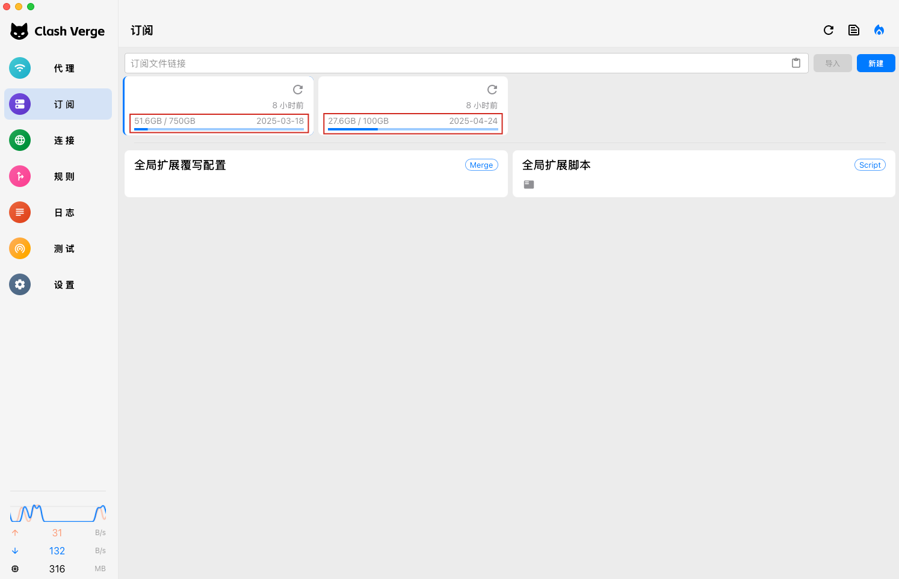
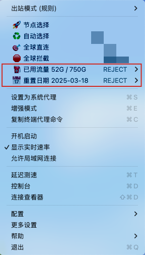

# VPSub

[](https://goreportcard.com/report/github.com/djx30103/vpsub)
[](https://github.com/djx30103/vpsub/releases)
[](https://github.com/djx30103/vpsub)
[](https://github.com/djx30103/vpsub/stargazers)
[](https://github.com/djx30103/vpsub/blob/main/LICENSE)

一个轻量级的VPS流量监控工具，帮助自建节点用户实时掌握各节点的流量使用情况。通过获取VPS服务商的流量数据并注入到订阅文件中，让你在使用代理客户端时直观地了解每个节点的流量状态。

## ✨ 核心特性

### 🔄 流量管理
- **实时监控**: 获取VPS流量使用数据，包括已用流量、剩余流量、总流量和重置时间
- **订阅集成**: 自动将流量信息注入到订阅文件，支持在代理软件中直观显示
- **灵活展示**: 支持自定义流量单位、日期格式和分组位置

### 🛠 系统特性
- **两层配置模型**: `providers` 管账号，`routes` 管路径，职责分离，多账号场景更易维护
- **路径与文件解耦**: 订阅链接与本地文件名独立，支持更简洁的访问路径
- **多账号复用**: 同一账号可被多个路由引用，无需重复填写
- **全局默认与局部覆盖**: 先设全局默认，再按路由单独覆盖缓存、超时、流量展示等
- **高效缓存**: 多级缓存机制，智能避免API限速，接口异常时降级返回原始文件
- **容器部署**: 支持Docker容器化部署，便于维护和迁移
- **多服务商**: 支持多种VPS服务商API，持续扩展中

## 📊 支持的服务商

| <div align="center">服务商</div> | <div align="center">流量查询</div> | <div align="center">重置日期</div> | <div align="center">配置参数映射</div> |
|:-------:|:---------:|:---------:|:-------------:|
| BandwagonHost | ✅ | ✅ | `api_id`: VEID<br>`api_key`: API KEY |
| RackNerd | ✅ | ✅<br>每月 1 日（美西时区） | `api_id`: API Hash<br>`api_key`: API Key |
| 更多服务商 | 🔄 | 🔄 | 敬请期待 |
| Passthrough * | — | — | `api_id`: 无需<br>`api_key`: 无需 |

> \* `passthrough` 为特殊类型，不调用服务商 API，订阅文件原样返回，不附加任何流量信息。

## 🔍 工作原理

VPSub 通过以下步骤处理每个订阅请求：

1. 根据请求路径匹配对应的 `route` 配置
2. 通过 `provider_ref` 找到对应的服务商账号
3. 调用服务商 API 获取流量数据（带缓存机制）
4. 读取 `route` 中指定的本地订阅文件
5. 将流量信息写入 HTTP 响应头
6. 如果启用 `usage_display`，将流量信息追加到订阅分组中
7. 返回处理后的订阅内容（API 异常时降级返回原始文件）

## 使用效果

### Clash Verge Rev


### ClashX (添加流量组后的效果)



## 🚀 快速开始

### 1. 安装部署

#### 方式一：直接运行

```bash
# 克隆仓库
git clone https://github.com/djx30103/vpsub.git
cd vpsub

# 直接运行
go run ./cmd/server

# 或者构建后运行
go build -o vpsub ./cmd/server
./vpsub
```

#### 方式二：Docker部署

```bash
docker run -d \
  --name vpsub \
  -p 30103:30103 \
  -v $(pwd)/config:/app/config \
  -v $(pwd)/subscriptions:/app/subscriptions \
  ghcr.io/djx30103/vpsub:latest
```

#### 方式三：使用Docker Compose

```yaml
services:
  vpsub:
    image: ghcr.io/djx30103/vpsub:latest
    container_name: vpsub
    ports:
      - "30103:30103"
    volumes:
      - ./data/config:/app/config
      - ./data/subscriptions:/app/subscriptions
    restart: unless-stopped
    environment:
      TZ: Asia/Shanghai
```

运行：

```bash
docker-compose up -d
```

### 2. 目录结构

- **config**: 存放配置文件 `config.yml`
- **subscriptions**: 存放订阅文件（支持子目录组织）

### 3. 配置文件

#### 基础配置

`providers` 定义服务商账号，`routes` 定义订阅路径并引用账号：

```yaml
providers:
  hk-bwh:
    type: bandwagonhost
    api_id: "VEID"
    api_key: "API KEY"

routes:
  - path: "/client-a"
    file: "hk/proxy.yaml"
    provider_ref: "hk-bwh"
```

| 配置项 | 说明 |
|:------|:-----|
| `providers.<name>` | 服务商账号，名称自定义，供 `provider_ref` 引用 |
| `providers.<name>.type` | 服务商类型，见[支持的服务商](#-支持的服务商) |
| `providers.<name>.api_id` | 服务商账号标识，各服务商含义不同（`passthrough` 类型无需填写） |
| `providers.<name>.api_key` | 服务商 API 密钥（`passthrough` 类型无需填写） |
| `routes[].path` | 对外访问路径，必须以 `/` 开头且唯一 |
| `routes[].file` | 本地订阅文件路径，相对于 `subscriptions/` 目录，必须使用相对路径，不能使用 `..` 或绝对路径 |
| `routes[].provider_ref` | 引用的服务商账号名，必须已在 `providers` 中定义 |

> 修改配置文件后需重启服务生效，订阅文件修改后无需重启。

如果只需要将订阅文件原样对外暴露，无需流量信息，可使用 `passthrough` 类型，不需要填写 `api_id` 和 `api_key`：

```yaml
providers:
  static-sub:
    type: passthrough

routes:
  - path: "/client-b"
    file: "static.yaml"
    provider_ref: "static-sub"
```

#### 流量展示（usage_display）

启用后，会在订阅分组中追加流量和重置日期信息：

```yaml
defaults:
  usage_display:
    enable: true
    prepend: false                                    # true: 置顶，false: 末尾
    traffic_format: "⛽ 已用流量 {{.used}} / {{.total}}"
    traffic_unit: "G"                                 # 可选: K、M、G、T
    reset_time_format: "📅 重置日期 {{.year}}-{{.month}}-{{.day}}"
```

**模板变量说明：**

| 变量 | 用途 | 所属字段 |
|:-----|:-----|:--------|
| `{{.used}}` | 已用流量 | `traffic_format` |
| `{{.total}}` | 总流量 | `traffic_format` |
| `{{.year}}` | 重置年份 | `reset_time_format` |
| `{{.month}}` | 重置月份 | `reset_time_format` |
| `{{.day}}` | 重置日期 | `reset_time_format` |

> `traffic_format` 必须同时包含 `{{.used}}` 和 `{{.total}}`；`reset_time_format` 至少包含一个日期变量，且只支持 `{{.year}}`、`{{.month}}`、`{{.day}}`。

也可以在单个 `route` 中覆盖，未覆盖的字段继续继承 `defaults`：

```yaml
routes:
  - path: "/client-a"
    file: "hk/proxy.yaml"
    provider_ref: "hk-bwh"
    usage_display:
      enable: true
      prepend: true
      traffic_unit: "M"
```

#### 访问控制（access_control）

可按 `User-Agent` 限制订阅路径的访问来源，未配置时不校验：

```yaml
routes:
  - path: "/client-a"
    file: "hk/proxy.yaml"
    provider_ref: "hk-bwh"
    access_control:
      user_agent: "ClashX"   # 仅允许 User-Agent 与 "ClashX" 完全一致的请求
```

#### 全局默认与覆写（defaults & overrides）

在 `defaults` 中设置全局默认值，在单个 `provider` 的 `overrides` 中按需覆写：

```yaml
defaults:
  provider:
    api_ttl: 300s          # 服务商 API 缓存时间，0 表示不缓存
    request_timeout: 10s   # API 请求超时
    update_interval: 24h   # 客户端订阅更新间隔

providers:
  us-bwh:
    type: bandwagonhost
    api_id: "VEID"
    api_key: "API KEY"
    overrides:             # 覆盖该账号的默认值
      api_ttl: 120s
      request_timeout: 15s
      update_interval: 12h
```

#### 完整配置参考

- 最小配置示例：[config/config.yml](config/config.yml)
- 完整配置示例：[config/config.full.yml](config/config.full.yml)

### 4. 使用订阅链接

`path` 即完整对外路径，订阅链接格式为：

```
http://your-server:30103<path>
```

例如 `path: "/client-a"` 对应：

```
http://your-server:30103/client-a
```


## 📄 许可证

本项目采用MIT许可证，详见[LICENSE](LICENSE)文件。
